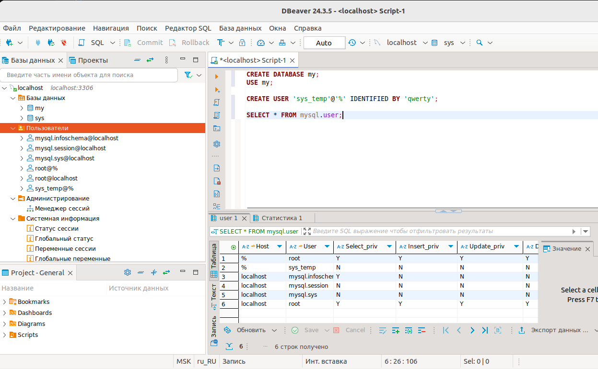

# Домашнее задание к занятию «Работа с данными (DDL/DML)»

### Задание 1
1.1. Поднимите чистый инстанс MySQL версии 8.0+. Можно использовать локальный сервер или контейнер Docker.

1.2. Создайте учётную запись sys_temp. 

1.3. Выполните запрос на получение списка пользователей в базе данных. (скриншот)

1.4. Дайте все права для пользователя sys_temp. 

1.5. Выполните запрос на получение списка прав для пользователя sys_temp. (скриншот)

1.6. Переподключитесь к базе данных от имени sys_temp.

Для смены типа аутентификации с sha2 используйте запрос: 
```sql
ALTER USER 'sys_test'@'localhost' IDENTIFIED WITH mysql_native_password BY 'password';
```
1.6. По ссылке https://downloads.mysql.com/docs/sakila-db.zip скачайте дамп базы данных.

1.7. Восстановите дамп в базу данных.

1.8. При работе в IDE сформируйте ER-диаграмму получившейся базы данных. При работе в командной строке используйте команду для получения всех таблиц базы данных. (скриншот)

*Результатом работы должны быть скриншоты обозначенных заданий, а также простыня со всеми запросами.*

### Решение:

1.1 Качаем DBeaver 
wget https://dbeaver.io/files/dbeaver-ce_latest_amd64.deb
sudo dpkg -i dbeaver-ce_latest_amd64.deb
sudo apt-get install -f
Запуск командой dbeaver
Запускаем mysql в контейнере docker run --name test_db -p3306:3306 -e MYSQL_ROOT_PASSWORD=secret -d mysql:latest
Создаем подключение к базе данных в dbeaver

Прописываем пароль и жмем готово:

1.2\1.3 Создаем базу и пользователя, делаем запрос:

1.4.\1.5 Даем права и запрашиваем список прав: GRANT ALL PRIVILEGES ON *.* TO 'sys_temp'@'%';

1.6 прописываем в url jdbc:mysql://localhost:3306/?allowPublicKeyRetrieval=true&useSSL=false
и под паролем и логином sys_temp создаем новое подключение.
итог - создано новое подключение под пользователем sys_temp


1.7\1.8 Восстанавливаем дамп и делаем диаграмму:


### Задание 2

Составьте таблицу, используя любой текстовый редактор или Excel, в которой должно быть два столбца: в первом должны быть названия таблиц восстановленной базы, во втором названия первичных ключей этих таблиц. Пример: (скриншот/текст)
```
Название таблицы | Название первичного ключа
customer         | customer_id
```

### Решение:


